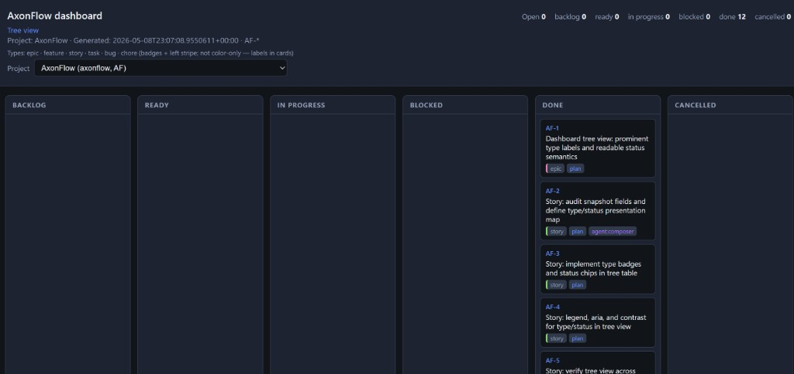

# AxonFlow

**Repository:** [github.com/Dayne-Wilkinson/axonflow](https://github.com/Dayne-Wilkinson/axonflow)

AxonFlow is a **.NET 8** command-line tool that stores your work in **one SQLite database** as a graph: epics, features, stories, tasks, bugs, and chores in a hierarchy; **dependencies** (“finish A before B”); **blockers**; **emergent** work with **provenance**; and **notes** on items.

It is aimed at **coding agents** (stable **`--json`** output, **`client_key`** idempotency, **`item import`**, explainable **`item next`**) and **humans** (terminal **`board`** / **`tree`**, **`export`**, optional **browser dashboard**).

Your database file lives under your profile by default (**`%USERPROFILE%\.axonflow\axonflow.db`** on Windows, **`~/.axonflow/axonflow.db`** elsewhere). Items are separated by **project slug** (`--project`), not by using multiple database files for day-to-day work.

---

## Quick start

```bash
dotnet run --project src/AxonFlow -- item add --type task --title "First task" --project default --json
dotnet run --project src/AxonFlow -- item next --project default --json
```

Use **`--help`** on the root command or any subcommand for full option lists.

---

## Install as `axonflow` (global tool)

From the repo (version matches [`src/AxonFlow/AxonFlow.csproj`](src/AxonFlow/AxonFlow.csproj), currently **0.2.0**):

```bash
dotnet pack src/AxonFlow/AxonFlow.csproj -c Release -o ./artifacts
dotnet tool install --global AxonFlow --source ./artifacts --version 0.2.0
```

Or run **`scripts/install-global.ps1`** (Windows) / **`scripts/install-global.sh`** (Unix). Ensure **`%USERPROFILE%\.dotnet\tools`** (Windows) or **`~/.dotnet/tools`** is on your **`PATH`**.

---

## Global options (most commands)

| Option | Default | Description |
|--------|---------|-------------|
| `--db` | `~/.axonflow/axonflow.db` | SQLite file path |
| `--project` | *from current folder name* | Project slug (sanitized). Omit for exploratory use; scripts often use **`--project default`**. |
| `--json` | off | Machine-readable stdout |
| `--quiet` | off | Suppress non-error stdout |
| `--dry-run` | off | Validate only; no writes (where supported). Not supported by **`dashboard`**. |

---

## Commands (summary)

| Area | Commands |
|------|----------|
| Meta | `schema`, `init` |
| Projects | `project add`, `project list`, `project set-name` |
| Items | `item add`, `list`, `show`, `update`, `import`, `start`, `next`, `complete`, `cancel`, `reopen`, `note add`, `defer` |
| Dependencies | `dep add`, `dep remove` |
| Views & export | `tree`, `board`, `validate`, `export` |
| Browser UI | `dashboard` |

**`item list`** supports filters such as **`--status`**, **`--type`**, **`--parent`**, **`--stream`**, **`--assigned-to`**, **`--title-contains`**, **`--body-contains`**, **`--updated-after`** (ISO-8601 UTC), **`--ref-prefix`**, **`--sort`**, **`--limit`**. **`item update`** accepts **`--ref`** or **`--id`** and can set **`--body`**, **`--body-file`**, or **`--clear-body`**.

**`export`** uses **`--format`** (default **`json`**; **`markdown`** lists items as a simple Markdown outline).

---

## Web dashboard (read-only)

Run **`axonflow dashboard`** to start a **loopback-only** server at **`http://127.0.0.1:5057`**.

- **`/`** ( **`index.html`** ) — Kanban-style **board** by status, with status counts and a **project picker** (all projects in the database are available).
- **`/tree.html`** — **Tree** table: ref, type, status, title, with rows indented by parent/child hierarchy.
- **`/mindmap.html`** — redirects to **`tree.html`** for older bookmarks.

The UI loads live data from **`GET /api/snapshot`** (the shipped server sets **`allProjects=1`** so the picker can show every project in the database) and refreshes every **120 seconds**. Clicking a card opens detail; when served live, the detail pane loads **`GET /api/item`** (JSON). Query parameters: **`ref`** (required), **`project`** (optional; defaults to the dashboard’s bootstrapped project slug), **`notes`** (boolean), **`notesLimit`** (optional; capped at **200**, default **20** when notes are requested).

Static bootstrap files are written under **`%USERPROFILE%\.axonflow\dashboard-cache`** (Windows) or **`~/.axonflow/dashboard-cache`**. Stop the server with **Ctrl+C**. Pass **`--json`** to avoid opening a browser; **`dashboard`** does not support **`--dry-run`**.

### Board (Kanban)



### Tree view


### Item detail (JSON)


---

## Cursor agent skill

Project skill (Markdown instructions for agents): [`.cursor/skills/axonflow/SKILL.md`](.cursor/skills/axonflow/SKILL.md). Copy that folder into another repo’s **`.cursor/skills/`** or your user **`~/.cursor/skills/axonflow/`** if you want the same workflows everywhere.

---

## Build & test

```bash
dotnet build AxonFlow.sln
dotnet test AxonFlow.sln
```
