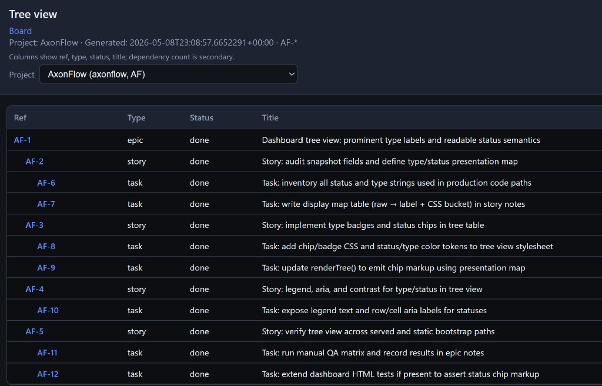
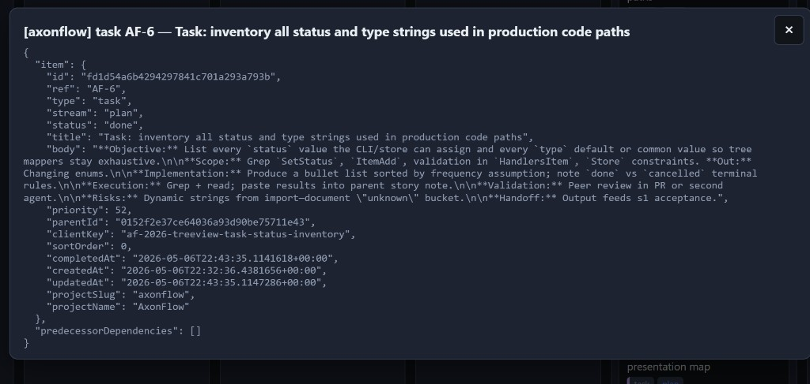

# AxonFlow

**Repository:** [github.com/Dayne-Wilkinson/axonflow](https://github.com/Dayne-Wilkinson/axonflow)

AxonFlow is a **.NET 8** command-line tool that keeps a **single plan of record** for work: a **SQLite database** that models your backlog as a **graph**, not a flat list. Work items have types (**epic**, **feature**, **story**, **task**, **bug**, **chore**) and sit in a **parent/child hierarchy**. **Dependencies** express finish-to-start order (“do A before B”). **Blockers** record what is stopping progress. **Emergent** items capture work discovered mid-flight, with **provenance** so you know where the idea came from. **Notes** append a dated log on each item without rewriting specs inside chat transcripts.

You slice the database by **project** (`--project` / slug). Humans get readable **`board`** and **`tree`** views, **`export`** to JSON or Markdown, and an optional **browser dashboard**. Agents get a stable **`--json`** contract, **`client_key`** for idempotent creates, **`item import`** for bulk loads, and explainable **`item next`** output (what was picked, what was skipped, and why).

### Why LLMs and coding agents benefit

Long chats **lose detail** (summarization, context limits) and **fork** when you run parallel sessions or switch models. Spreadsheets and ad hoc Markdown notes drift out of sync with what the code actually needs next. AxonFlow gives agents something closer to how they already interact with code: **a small CLI with predictable stdout**, so “what is blocked?”, “what should we pick next?”, and “what did we decide for AF-12?” stay **queryable and durable** instead of buried in scrollback.

More concretely:

- **Structured state** — Status, type, parent, dependencies, and notes live in one schema agents can **list**, **filter**, and **update** without inventing their own taxonomy each session.
- **Machine-readable I/O** — **`--json`** responses are easy to parse in scripts and agent loops; fewer brittle regexes over prose.
- **Repeatable workflows** — **`item next`**, **`item start`**, **`item note add`**, **`validate`** map to discrete tool calls with clear success and failure modes.
- **Idempotency and bulk work** — **`client_key`** avoids duplicate items when a step retries; **`item import`** applies large plan payloads safely (often with **`--dry-run`** first).
- **Explainability** — **`item next`** can return **`picked`**, **`candidates`**, and **`excluded`** with reasons, so an agent (or you) can audit why something was or was not chosen.

None of this replaces code review or judgment; it gives **shared ground truth** for planning and execution across turns, branches, and machines.

Your database file lives under your profile by default (**`%USERPROFILE%\.axonflow\axonflow.db`** on Windows, **`~/.axonflow/axonflow.db`** elsewhere). Items are separated by **project slug**, not by maintaining separate database files for everyday work.

---

## Quick start

```bash
dotnet run --project src/AxonFlow -- item add --type task --title "First task" --project default --json
dotnet run --project src/AxonFlow -- item next --project default --json
```

Use **`--help`** on the root command or any subcommand for full option lists.

---

## Install as `axonflow` (global tool)

From the repo (version matches [`src/AxonFlow/AxonFlow.csproj`](src/AxonFlow/AxonFlow.csproj), currently **0.2.0**):

```bash
dotnet pack src/AxonFlow/AxonFlow.csproj -c Release -o ./artifacts
dotnet tool install --global AxonFlow --source ./artifacts --version 0.2.0
```

Or run **`scripts\install-global.cmd`** from the repo root (Windows; avoids PowerShell execution-policy prompts by invoking the installer with **`Bypass`**) / **`scripts/install-global.sh`** (Unix). Ensure **`%USERPROFILE%\.dotnet\tools`** (Windows) or **`~/.dotnet/tools`** is on your **`PATH`**.

---

## Global options (most commands)

| Option | Default | Description |
|--------|---------|-------------|
| `--db` | `~/.axonflow/axonflow.db` | SQLite file path |
| `--project` | *from current folder name* | Project slug (sanitized). Omit for exploratory use; scripts often use **`--project default`**. |
| `--json` | off | Machine-readable stdout |
| `--quiet` | off | Suppress non-error stdout |
| `--dry-run` | off | Validate only; no writes (where supported). Not supported by **`dashboard`**. |

---

## Commands (summary)

| Area | Commands |
|------|----------|
| Meta | `schema`, `init` |
| Projects | `project add`, `project list`, `project set-name` |
| Items | `item add`, `list`, `show`, `update`, `import`, `start`, `next`, `complete`, `cancel`, `reopen`, `note add`, `defer` |
| Dependencies | `dep add`, `dep remove` |
| Views & export | `tree`, `board`, `validate`, `export` |
| Browser UI | `dashboard` |

**`item list`** supports filters such as **`--status`**, **`--type`**, **`--parent`**, **`--stream`**, **`--assigned-to`**, **`--title-contains`**, **`--body-contains`**, **`--updated-after`** (ISO-8601 UTC), **`--ref-prefix`**, **`--sort`**, **`--limit`**. **`item update`** accepts **`--ref`** or **`--id`** and can set **`--body`**, **`--body-file`**, or **`--clear-body`**.

**`export`** uses **`--format`** (default **`json`**; **`markdown`** lists items as a simple Markdown outline).

---

## Web dashboard (read-only)

Run **`axonflow dashboard`** to start a **loopback-only** server at **`http://127.0.0.1:5057`**.

- **`/`** ( **`index.html`** ) — Kanban-style **board** by status, with status counts and a **project picker** (all projects in the database are available).
- **`/tree.html`** — **Tree** table: ref, type, status, title, with rows indented by parent/child hierarchy.
- **`/mindmap.html`** — redirects to **`tree.html`** for older bookmarks.

The UI loads live data from **`GET /api/snapshot`** (the shipped server sets **`allProjects=1`** so the picker can show every project in the database) and refreshes every **120 seconds**. Clicking a card opens detail; when served live, the detail pane loads **`GET /api/item`** (JSON). Query parameters: **`ref`** (required), **`project`** (optional; defaults to the dashboard’s bootstrapped project slug), **`notes`** (boolean), **`notesLimit`** (optional; capped at **200**, default **20** when notes are requested).

Static bootstrap files are written under **`%USERPROFILE%\.axonflow\dashboard-cache`** (Windows) or **`~/.axonflow/dashboard-cache`**. Stop the server with **Ctrl+C**. Pass **`--json`** to avoid opening a browser; **`dashboard`** does not support **`--dry-run`**.

### Board (Kanban)


### Tree view



### Item detail (JSON)



---

## Cursor agent skill

Project skill (Markdown instructions for agents): [`.cursor/skills/axonflow/SKILL.md`](.cursor/skills/axonflow/SKILL.md). Copy that folder into another repo’s **`.cursor/skills/`** or your user **`~/.cursor/skills/axonflow/`** if you want the same workflows everywhere.

---

## Build & test

```bash
dotnet build AxonFlow.sln
dotnet test AxonFlow.sln
```
